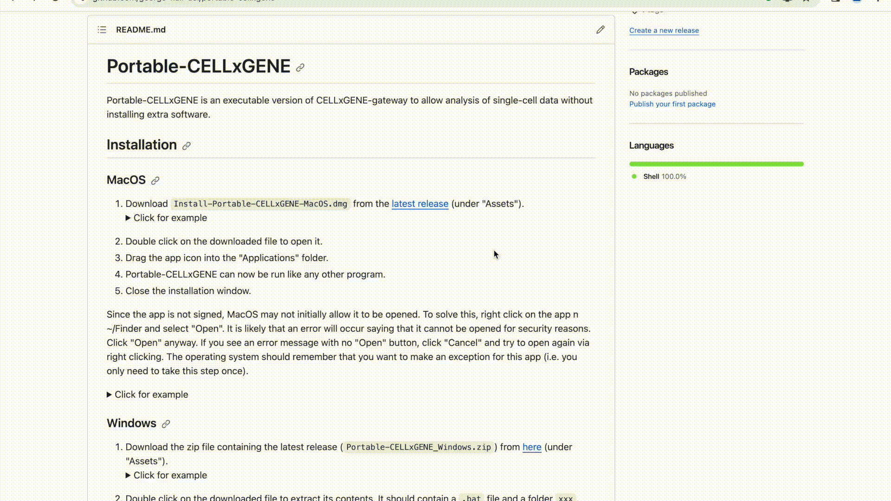
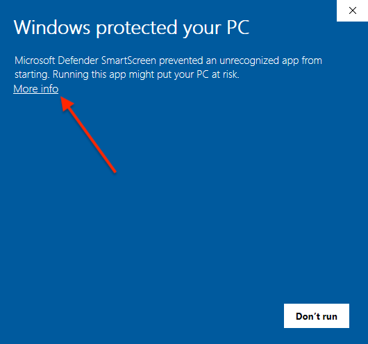
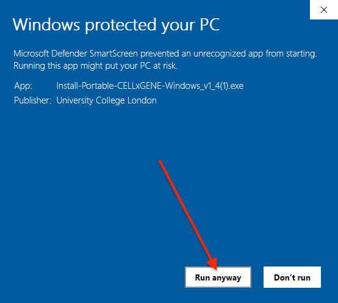

<h1>Portable-CELLxGENE</h1>

**Portable-CELLxGENE** is a standalone version of
[CELLxGENE](https://github.com/chanzuckerberg/cellxgene) and
[CELLxGENE-gateway](https://github.com/Novartis/cellxgene-gateway) to allow
single-cell transcriptomic data to be annotated without needing the command
line or extra software.

## Installation

### MacOS

1. If your computer has an Apple M-series chip, download the installer from
   [here](https://github.com/george-hall-ucl/portable-cellxgene/releases/latest/download/Install-Portable-CELLxGENE-MacOS-apple-silicon.dmg).
   If it has an intel chip, download the installer from
   [here](https://github.com/george-hall-ucl/portable-cellxgene/releases/latest/download/Install-Portable-CELLxGENE-MacOS-intel.dmg).
   (to determine whether your Mac has an Apple M-series chip or an intel chip,
   click the Apple logo in the top left corner of your screen, go to "About
   This Mac" and look under "Chip").
2. Double click on the downloaded file to open it.
3. Drag the app's icon into the `Applications` folder.
4. Portable-CELLxGENE can now be run like any other program.

Click to reveal video of installation process

<kbd></kbd>

### Windows

1. Download the installation program from
   [here](https://github.com/george-hall-ucl/portable-cellxgene/releases/download/v1.4/Install-Portable-CELLxGENE-Windows_v1_4.exe).
2. Double click on the downloaded file to run it. It should download and
   install Portable-CELLxGENE.

Since the software is new, Windows Defender SmartScreen may try to block its
execution. If this happens, you will see a pop-up saying "Windows protected
your PC". Click `More info` and then `Run anyway`. You should only need to do
this once for the installer and once for the program itself.

Click to reveal images showing how to bypass SmartScreen

    

    <kbd></kbd>
    <kbd></kbd>
    

## Running Portable-CELLxGENE

Click to reveal video of basic Portable-CELLxGENE usage

Recorded in MacOS, but the process is similar in Windows.
<kbd></kbd>

1. A file browser will open. Navigate to the folder containing your `.h5ad` and
   click "Open".
2. A page listing the datasets should open in your browser. If it does not open
   after a minute, then navigate to
   [http://127.0.0.1:5005/portable_home.html](http://127.0.0.1:5005/portable_home.html)
   yourself. If the page opened automatically but is not displaying anything,
   then you may need to refresh it.
3. Follow the instructions on the homepage.
4. Once you are finished, close the CELLxGENE browser tab(s) and quit the
   app.

Note: Each annotation session will continue running in the background until
either the Portable-CELLxGENE app is terminated or the session is closed from
the "View running sessions" page (see end of above video). For large datasets,
this may slow down your computer so it is advisable to terminate them once you
are finished.

## How to use CELLxGENE

There are many guides on how to use CELLxGENE available online, for example a
basic introduction can be found
[here](https://icbi-lab.github.io/cellxgene-user-guide/). The official
documentation of CELLxGENE is
[here](https://cellxgene.cziscience.com/docs/01__CellxGene), which gives
in-depth information on its use.

