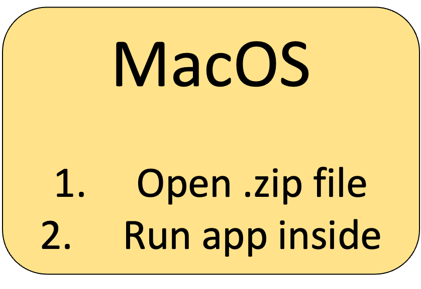
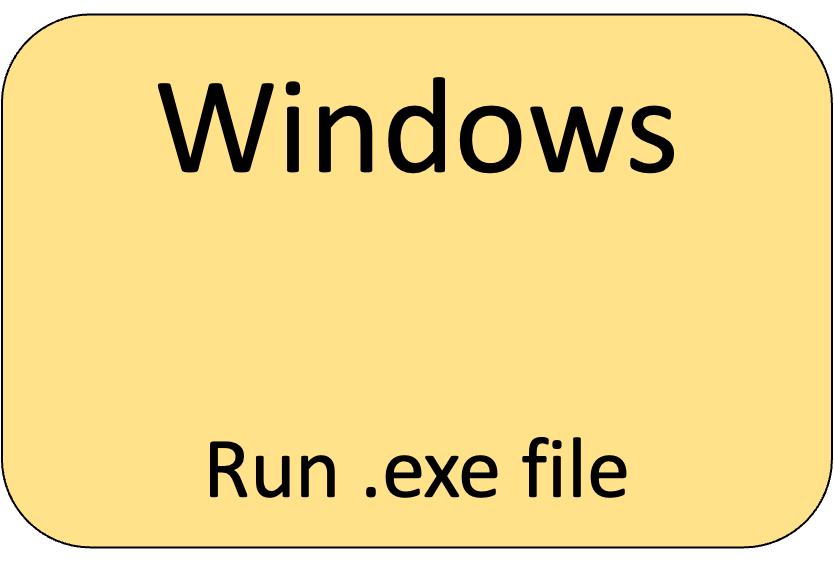

<h1>Portable-CELLxGENE</h1>

**Portable-CELLxGENE** is a standalone version of
[CELLxGENE](https://github.com/chanzuckerberg/cellxgene) and
[CELLxGENE-gateway](https://github.com/Novartis/cellxgene-gateway) to allow
single-cell transcriptomic data to be annotated without needing the command
line or extra software.

 

<h2>Click to install</h2>

&nbsp;

Having problems? Visit the [installation](installation.html) page.
 

## Running Portable-CELLxGENE

Click to reveal video of basic Portable-CELLxGENE usage

Recorded in MacOS, but the process is similar in Windows.
<kbd></kbd>

1. A file browser will open. Navigate to the folder containing your `.h5ad` and
   click "Open".
2. A page listing the datasets should open in your browser. If it does not open
   after a minute, then navigate to
   [http://127.0.0.1:5005/portable_home.html](http://127.0.0.1:5005/portable_home.html)
   yourself. If the page opened automatically but is not displaying anything,
   then you may need to refresh it.
3. Follow the instructions on the homepage.
4. Once you are finished, close the CELLxGENE browser tab(s) and quit the
   app.

Note: Each annotation session will continue running in the background until
either the Portable-CELLxGENE app is terminated or the session is closed from
the "View running sessions" page (see end of above video). For large datasets,
this may slow down your computer so it is advisable to terminate them once you
are finished.

## How to use CELLxGENE

There are many guides on how to use CELLxGENE available online, for example a
basic introduction can be found
[here](https://icbi-lab.github.io/cellxgene-user-guide/). The official
documentation of CELLxGENE is
[here](https://cellxgene.cziscience.com/docs/01__CellxGene), which gives
in-depth information on its use.

