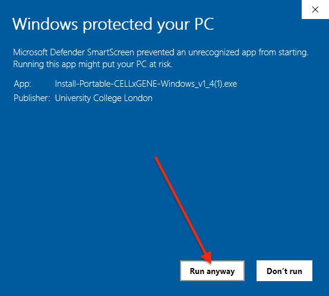

# Installation

These are more detailed installation instructions in case the process on the
homepage does not work for you.

## MacOS

1. If your computer has an Apple M-series chip, download the installer from
   [here](https://github.com/george-hall-ucl/portable-cellxgene/releases/latest/download/Install-Portable-CELLxGENE-MacOS-apple-silicon.dmg).
   If it has an intel chip, download the installer from
   [here](https://github.com/george-hall-ucl/portable-cellxgene/releases/latest/download/Install-Portable-CELLxGENE-MacOS-intel.dmg).
   (to determine whether your Mac has an Apple M-series chip or an intel chip,
   click the Apple logo in the top left corner of your screen, go to "About
   This Mac" and look under "Chip").
2. Double click on the downloaded file to open it.
3. Drag the app's icon into the `Applications` folder.
4. Portable-CELLxGENE can now be run like any other program.

Click to reveal video of installation process

<kbd></kbd>

## Windows

1. Download the installation program from
   [here](https://github.com/george-hall-ucl/portable-cellxgene/releases/download/v1.4/Install-Portable-CELLxGENE-Windows_v1_4.exe).
2. Double click on the downloaded file to run it. It should download and
   install Portable-CELLxGENE.

Since the software is new, Windows Defender SmartScreen may try to block its
execution. If this happens, you will see a pop-up saying "Windows protected
your PC". Click `More info` and then `Run anyway`. You should only need to do
this once for the installer and once for the program itself. You may also need
to allow Python to bypass the Windows firewall.

Click to reveal images showing how to bypass SmartScreen

    

    <kbd></kbd>
    <kbd></kbd>
    

